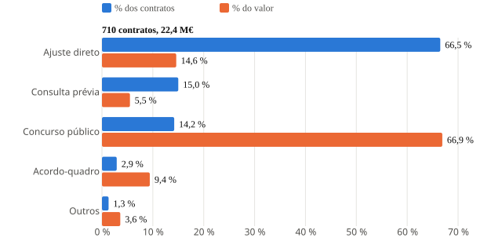

# Newsroom Agents

[](https://github.com/afonsoajrodrigues/newsroom-agents/actions/workflows/check.yml)
[English version](README.md)

Plugins de Claude Code que transformam o Claude numa redação de investigação: um orquestrador que planeia a história e mantém o registo de provas, e especialistas em registos públicos portugueses, investigação em fontes abertas (OSINT), verificação de factos, estruturas societárias e offshores, processamento de documentos, e gráficos e mapas prontos a publicar. Todas as fontes são gratuitas e nenhuma precisa de chave de API. Todos os agentes trabalham com regras de redação: fontes primárias, registo de provas com data de acesso e arquivo, graus de confiança explícitos, contraditório e limites rígidos de privacidade.

Dois resultados produzidos de ponta a ponta com dados públicos reais em 2026-09-12:

| [Contratos da Câmara de Lisboa em 2025](examples/lisboa-contratos-2025/) | [Peso do ajuste direto nas câmaras da Madeira](examples/madeira-ajustes-diretos-2025/) |
|---|---|
|  |  |
| 1067 contratos recolhidos do Portal BASE com `base-summary.py`, agregados, desenhados a partir do template e validados pelo `render-check.mjs`. | Limites oficiais da CAOP via `geo-prep.py`, contratos de 11 câmaras recolhidos do Portal BASE, cruzados por código INE, mapeados a partir do template. |

## Instalação

```
/plugin marketplace add afonsoajrodrigues/newsroom-agents
/plugin install newsroom-core@newsroom-agents
/plugin install pt-public-records@newsroom-agents
/plugin install newsroom-graphics@newsroom-agents
/plugin install osint-toolkit@newsroom-agents
/plugin install fact-check@newsroom-agents
/plugin install financial-corporate@newsroom-agents
/plugin install document-tools@newsroom-agents
```

Cada plugin funciona sozinho. Comece pelo `newsroom-core`: sabe usar os outros quando estão instalados. Instalar os sete acrescenta cerca de 4 300 tokens a cada sessão (`claude plugin details <plugin>@newsroom-agents`); o prompt completo de um agente só é carregado quando ele é chamado. O caminho de instalação acima foi testado contra este repositório em 2026-09-13.

## O que inclui

| Plugin | Agentes | Comandos, skills e scripts |
|---|---|---|
| `newsroom-core` | `investigation-lead` (planeia, delega, mantém o registo de provas), `timeline-builder`, `data-analyst`, `prepublication-reviewer` | `/newsroom-core:start-investigation <slug>` cria a pasta do caso; convenções do `evidence-log`; um hook que regista todos os URLs consultados em `investigations/access-log.tsv` |
| `pt-public-records` | `diario-republica-researcher`, `court-records-pt`, `procurement-watchdog`, `transparency-registers` | `/pt-public-records:lada-request <entidade> <documentos>` redige um pedido ao abrigo da Lei 26/2016; `/pt-public-records:base-summary <entidade>` extrai os contratos de uma entidade ou fornecedor para CSV com resumo; `pt-sources`, diretório verificado de mais de 60 fontes portuguesas com os endpoints gratuitos e os URLs de pesquisa da DGSI; `base-search.sh` consulta o Portal BASE em JSON; `base-summary.py` extrai todos os contratos de uma entidade para CSV com resumo |
| `newsroom-graphics` | `chart-builder` (gráficos D3), `map-builder` (coropletos, símbolos, mapas de localização com limites CAOP), `graphics-reviewer` | `/newsroom-graphics:new-graphic <slug> [chart\|map]` cria um gráfico a partir de templates testados; skills `viz-standards` (paleta validada para daltonismo, formatos pt-PT, checklist) e `pt-geodata`; `geo-prep.py` (qualquer ficheiro vetorial para TopoJSON simplificado); `render-check.mjs` (executa o gráfico em jsdom, verifica as regras e exporta um SVG autónomo) |
| `osint-toolkit` | `osint-researcher`, `image-geolocation`, `social-media-investigator`, `web-archiver` | mapa de ferramentas `osint-sources`; `archive.sh` guarda a página, calcula o hash, pede uma captura ao Wayback e consulta o Arquivo.pt |
| `fact-check` | `claim-verifier`, `source-triangulator` | `verification-standards`: escala de confiança e teste de independência das fontes |
| `financial-corporate` | `corporate-structure-mapper`, `offshore-leaks-researcher` | fluxos com GLEIF, Publicações MJ, RCBE, Companies House, ICIJ, OpenSanctions |
| `document-tools` | `pdf-archivist` | `pdf2md.py` converte PDF em Markdown com cache e OCR de recurso; `scrub.sh` remove metadados de ficheiros antes de serem partilhados; um hook que impede a leitura direta de PDFs |

## Uma investigação típica

```
/newsroom-core:start-investigation camara-x-contratos "A Câmara X adjudicou por ajuste direto a uma empresa ligada a um vereador"
```

Depois descreva a história ao Claude. O `investigation-lead` reformula a hipótese como uma afirmação verificável, escreve o plano de pesquisa e distribui o trabalho: o `procurement-watchdog` extrai os contratos do Portal BASE, o `corporate-structure-mapper` reconstitui a empresa através do GLEIF e das Publicações MJ, o `transparency-registers` encontra a declaração de interesses do vereador, o `web-archiver` preserva todas as páginas, o `timeline-builder` ordena os acontecimentos, o `chart-builder` e o `map-builder` transformam os contratos num gráfico e num mapa por concelho, e o `prepublication-reviewer` lista todas as frases sem prova e todas as pessoas a quem ainda falta dar o contraditório. Tudo fica em `investigations/<slug>/evidence-log.md`, e todos os URLs consultados por qualquer agente ficam em `investigations/access-log.tsv`. A pasta [`examples/investigation-skeleton/`](examples/investigation-skeleton/) mostra o resultado com linhas reais preenchidas.

Também pode simplesmente pedir em linguagem corrente:

> "Verifica se esta foto do protesto foi mesmo tirada em Lisboa esta semana"

O Claude encaminha o pedido para o `image-geolocation` a partir da descrição; todas as descrições dos agentes incluem as frases em português que os jornalistas realmente escrevem. Para forçar um especialista: "usa o agente court-records-pt".

## Fontes verificadas

Todos os URLs e endpoints citados nos plugins foram consultados e verificados em 2026-09-12, e o `scripts/check-sources.sh` volta a verificá-los. Sem chaves de API, sem serviços pagos. Endpoints JSON que os agentes usam diretamente: Portal BASE (através do `base-search.sh`, porque só responde a POST), dados.gov.pt, INE, Eurostat, BPstat do Banco de Portugal, TED, SNS Transparência, GLEIF, Wikidata, geoapi.pt, CDX do Wayback, Arquivo.pt, Open-Meteo, urlscan, OpenSky, Mapa de Sanções da UE. A jurisprudência da DGSI é pesquisada por URL, uma base por tribunal, com os identificadores em `pt-sources`.

Alguns sites são aplicações JavaScript ou bloqueiam clientes automáticos (Diário da República, Publicações MJ, OpenCorporates, pesquisa do ICIJ, Mais Transparência): o diretório marca-os como `browser`, e os agentes usam as ferramentas do Claude in Chrome nesses casos. O OCCRP Aleph exige conta gratuita. O RCBE (beneficiários efetivos) exige autenticação com Cartão de Cidadão e declaração de interesse legítimo, que os jornalistas de investigação têm ao abrigo do direito da UE.

## Requisitos

- Claude Code 2.1 ou posterior.
- `pt-public-records`: `curl` e `jq` (para o `base-search.sh`); Python 3 para o `base-summary.py`.
- `document-tools`: Python 3; o script instala o `pymupdf4llm` na primeira utilização. Para PDFs digitalizados instale o `ocrmypdf` (`brew install ocrmypdf`).
- `newsroom-graphics`: Node 18 ou posterior para o `render-check.mjs` (instala o `jsdom` na pasta de dados do plugin na primeira execução, com cache npm própria); Python com `geopandas` e `pyogrio` para o `geo-prep.py`, e `mapshaper` (`npm i -g mapshaper`) para simplificação com preservação de topologia. Os gráficos são HTML autónomo que só carrega o D3 fixado no jsdelivr.
- Opcional: `exiftool` para metadados de imagens, `ffmpeg` para fotogramas de vídeo, `pandas` para o `data-analyst` (instalado num venv na pasta do caso).

## Regras editoriais

Todos os agentes têm limites explícitos: só fontes públicas, nenhum acesso atrás de logins que não sejam do próprio jornalista, nenhuma exposição de particulares, padrões nos dados e coincidências em bases de dados são pistas e nunca prova, toda a afirmação tem fonte com data de acesso, e as afirmações desfavoráveis têm contraditório antes da publicação. Duas regras são impostas por hooks e não por prompts: os PDFs passam sempre pela pipeline de Markdown com cache, e todos os URLs consultados ficam registados. A revisão editorial e jurídica continua a aplicar-se.

## Contribuir

Os agentes são ficheiros Markdown com frontmatter YAML em `plugins/<plugin>/agents/`; conhecimento partilhado e comandos são `plugins/<plugin>/skills/<nome>/SKILL.md`. Veja o `CLAUDE.md` para as convenções e o `CHANGELOG.md` para o que mudou. Corra o `scripts/check.sh` antes de abrir um pull request (valida os manifestos, testa os scripts e renderiza os templates e os exemplos), o `scripts/check-sources.sh` quando alterar um URL de fonte, `claude plugin eval plugins/<plugin> --trust-plugin --no-publish` para os casos de avaliação em `evals/` de cada plugin (cinco casos em cinco plugins, todos a passar em 2026-09-13: escolha de fonte, escala de confiança, arquivos web, forma do mapa, linhas do registo de provas), e o `scripts/smoke.sh` para um teste real de ponta a ponta (uma sessão não interativa do Claude carrega o plugin, o agente extrai o Portal BASE através do script e a resposta é comparada com um cálculo independente; gasta créditos de API). Os ficheiros de trabalho das investigações (`investigations/`, `docs_cache/`, PDFs) estão no gitignore; mantenha o material dos casos fora deste repositório.

## Licença

MIT. Ver `LICENSE`. Dados dos exemplos: Portal BASE (IMPIC) e CAOP 2025 (DGT, CC BY 4.0).
